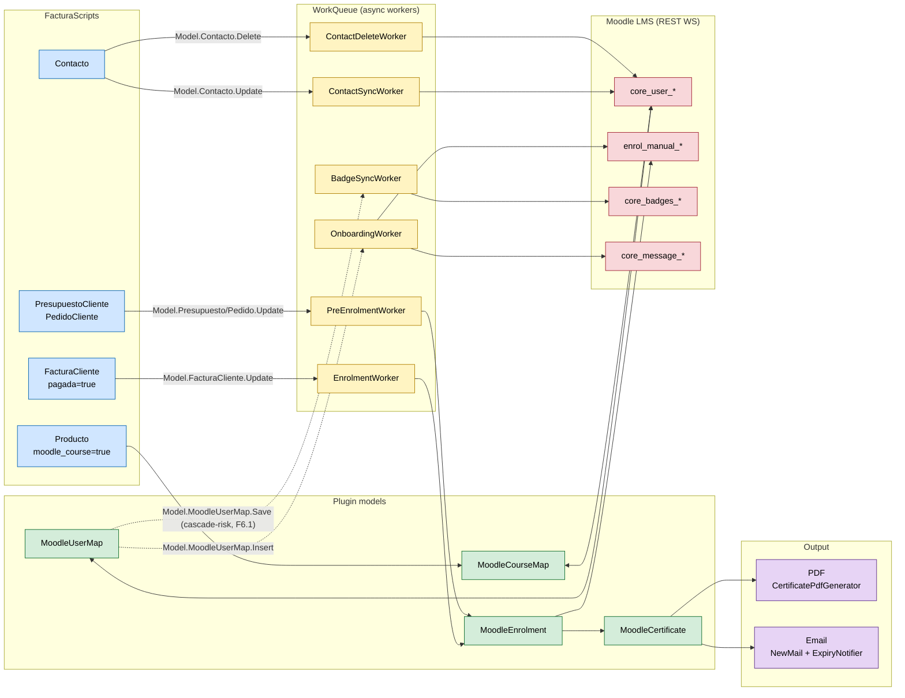
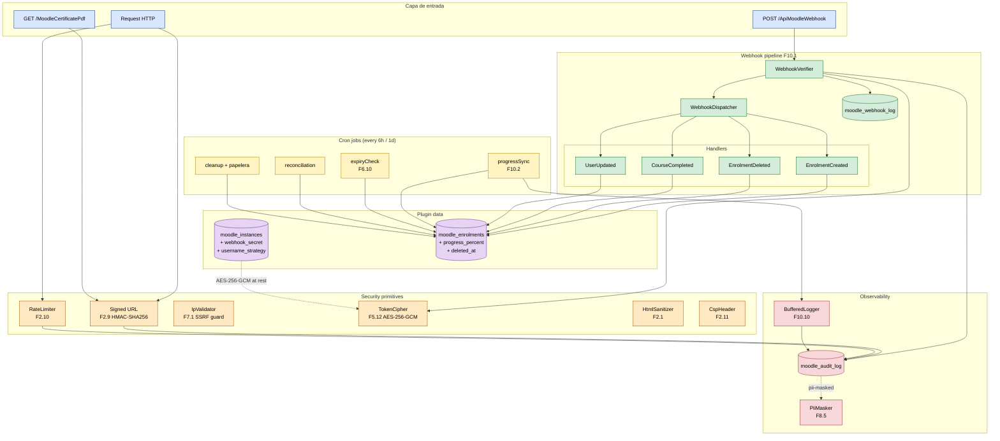

# MoodleManagement v2.0

Plugin para FacturaScripts que permite gestionar plataformas Moodle directamente desde el ERP. Conecta tu sistema de facturación con tu LMS mediante la API REST de Moodle.

*[English version below](#english--inglés)*

## Arquitectura — Flujo de datos

El diagrama muestra cómo una factura se convierte en una matrícula activa y, eventualmente, en un certificado entregado por email.

**Leyenda rápida**:
- **Flechas sólidas**: evento `Model.X.Update`/`Insert`/`Delete` que dispara el worker correspondiente.
- **Flechas punteadas**: eventos en vigilancia activa para la Fase 6 (cascadas pendientes de cortar).
- Los cron jobs (`healthCheck`, `userSync`, `courseSync`, `reconciliation`, `cleanup`, `expiryCheck`) consumen los mismos modelos pero se ejecutan en horario propio — no aparecen en este diagrama para mantenerlo legible.

### Capas añadidas en v2.0

> `@since 2.0 — V2.0-ACTION-PLAN F11.4 · §9.4`
>
> El siguiente diagrama complementa el flujo principal con las
> piezas introducidas durante la auditoría v2.0: capa de seguridad,
> endpoint de webhooks, papelera, registros de auditoría y sincronía
> de progreso académico. Se mantiene en un diagrama aparte para no
> saturar el canvas principal.

**Notas**:
- La capa **Security primitives** agrupa los helpers de `Lib/Security/*`
  introducidos en las Fases 2, 5 y 7. Cualquier controlador expuesto
  al exterior pasa por al menos uno de ellos.
- **WebhookDispatcher** mantiene la separación "verificar → auditar →
  despachar". El registro `moodle_webhook_log` se escribe tanto en
  éxito como en rechazo, facilitando el triage desde
  `ListMoodleAuditLog` (F10.3).
- **BufferedLogger** (F10.10) acumula eventos de los cron loops y
  los vuelca agrupados, reduciendo I/O de log en fase de alta
  actividad.

## Funcionalidades

### Gestión de Instancias Moodle
- Conexión a múltiples instancias de Moodle simultáneamente
- Test de conexión y monitoreo de estado (activa, mantenimiento, inactiva)
- Visualización de información del sitio (versión, release, funciones WS disponibles)
- Soporte para entornos: producción, staging, desarrollo

### Sincronización de Usuarios
- Importación masiva de usuarios desde Moodle a FacturaScripts
- Mapeo bidireccional usuario Moodle ↔ contacto FacturaScripts
- Creación automática de clientes/contactos al importar
- Sincronización individual y masiva

### Gestión de Cursos
- Importación y sincronización de cursos desde Moodle
- Vinculación de cursos Moodle con productos de FacturaScripts
- Creación automática de productos y familias por curso
- Duplicación de cursos directamente desde FS
- Gestión de categorías de cursos (importar, crear, sincronizar)
- Sincronización de imágenes de portada entre producto y curso

### Contenido del Curso (Actividades y Secciones)
- Visualización en tiempo real del contenido del curso vía API
- Gestión de secciones: crear, ocultar/mostrar, mover, eliminar
- Gestión de actividades: ocultar/mostrar, duplicar, mover entre secciones, eliminar
- Modo stealth (solo enlace) para actividades
- Indentación de actividades (derecha/izquierda)
- Cambio de modo de grupo (sin grupos, grupos separados, grupos visibles)
- Acciones masivas con selección múltiple
- Modal de detalle de módulo con información completa

### Matrículas (Enrolments)
- Gestión de matrículas por curso e instancia
- Soporte para métodos: manual, auto-matrícula, pago, cohort, meta-enlace
- Estados de matrícula: pendiente, matriculado, suspendido, desmatriculado
- Vinculación con documentos comerciales (facturas, pedidos, presupuestos)
- Meta-matrículas entre cursos

### Cohorts
- Importación de cohorts desde Moodle
- Sincronización de miembros
- Gestión de membresía (agregar/eliminar miembros)

### Roles
- Mapeo de los 8 roles estándar de Moodle por instancia
- Importación automática de roles estándar

### Badges y Certificados
- Sincronización de badges de Moodle a FacturaScripts por usuario
- Sincronización masiva de badges de todos los usuarios mapeados
- Sincronización automática al guardar un mapeo de usuario (Worker)
- Listado global de badges con filtros por contacto e instancia
- Vista de detalle de badge con datos de Moodle (nombre, curso, fecha, hash, URLs)

### Gestión de Grupos
- Visualización de grupos de un curso en tiempo real desde Moodle
- Crear y eliminar grupos en un curso directamente desde FS
- Ver miembros de cada grupo con conteo
- Agregar y eliminar miembros de grupos

### Mensajería
- Chat bidireccional estilo WhatsApp con usuarios Moodle (pestaña "Chat" en mapeo de usuario)
- Auto-refresh cada 5 segundos — los mensajes nuevos aparecen automáticamente sin recargar la página
- Nombre del contacto de FS en las burbujas de chat (no el ID de Moodle)
- Historial de conversación en tiempo real via API de Moodle
- Envío de mensajes instantáneos — el usuario los recibe en su mensajería de Moodle
- Respuestas del usuario visibles automáticamente en FS
- Botón "Enviar Mensaje" rápido desde el formulario del usuario (modal)
- Envío masivo a todos los matriculados de un curso (pestaña "Mensajería" en el curso)
- Selección de destinatarios: todos los matriculados o usuarios específicos
- **Hub de Conversaciones**: página central con todas las conversaciones abiertas de todas las instancias
  - Semáforo visual: rojo = mensajes sin leer, verde = todo leído
  - Badge con número de mensajes no leídos por conversación
  - Vista previa del último mensaje y marca temporal
  - Filtros: Todos, Solo No Leídos, Solo Leídos
  - Enlace directo al chat de cada usuario
  - Ordenación: conversaciones no leídas primero, luego por fecha del último mensaje
  - Botón "Nueva Conversación" con buscador de usuarios mapeados sin conversación abierta
  - Auto-refresh cada 10 segundos sin recargar la página
- Marcado automático de mensajes como leídos al abrir un chat
- **Icono de chat en la barra de navegación** con badge de mensajes no leídos (se actualiza cada 30 segundos)

### Reportes Académicos
- Progreso académico del alumno (cursos, actividades completadas, calificaciones) en tiempo real vía API
- Matrículas sin facturar (enrolled sin factura vinculada)
- Matrículas por estado (pendiente, matriculado, suspendido, desmatriculado)
- Matrículas por curso con filtros financieros

### Automatización de Procesos
- **Matrícula automática**: al pagar una factura con productos vinculados a cursos, el alumno se matricula automáticamente en Moodle
- **Pre-matrícula**: al crear presupuestos o pedidos, se generan matrículas pendientes que se activan al facturar
- **Sincronización de contactos**: al modificar un contacto en FS, los datos se sincronizan automáticamente con Moodle
- **Suspensión automática**: al eliminar un contacto en FS, se suspende su cuenta y matrículas en Moodle
- **Health check** (cada hora): monitoreo automático del estado de todas las instancias Moodle
- **Sincronización incremental** (cada 6 horas): sincronización de usuarios y cursos con resolución de conflictos
- **Reconciliación** (diaria): verificación de integridad de mapeos de usuarios y matrículas contra Moodle
- **Limpieza** (diaria): eliminación automática de mapeos huérfanos (contactos eliminados)
- **Control de expiración** (cada 6 horas): detección de matrículas por vencer (7 días), expiración automática y generación de presupuestos de renovación

### Notas y Anotaciones
- Crear, leer y eliminar notas en el perfil de usuarios de Moodle desde FS
- Pestaña "Notas" en el mapeo de usuario con historial completo
- Soporte para notas de tipo sitio y personal
- Notas ordenadas por fecha de creación (más reciente primero)

### Calendario de Moodle
- Crear y eliminar eventos en el calendario de usuarios de Moodle desde FS
- Pestaña "Calendario" en el mapeo de usuario
- Visualización de eventos existentes con tipo y descripción
- Soporte para eventos de tipo usuario

### Facturación Avanzada (Suscripciones y Renovación)
- Campo `duracion_dias` en cursos para definir la duración de acceso tras la matrícula
- Cálculo automático de `timeend` al matricular (timestart + duración en días)
- Generación automática de presupuestos de renovación cuando una matrícula está por expirar (7 días)
- El presupuesto incluye el producto del curso al precio configurado, vinculado al cliente del contacto
- Flujo completo: presupuesto → aprobación → factura → EnrolmentWorker renueva la matrícula

### Onboarding Automatizado
- Configuración por instancia: curso de bienvenida, cohort por defecto, mensaje de bienvenida
- Al crear un nuevo mapeo de usuario, el sistema automáticamente:
  1. Matricula al usuario en el curso de bienvenida configurado
  2. Lo asigna al cohort por defecto
  3. Le envía un mensaje de bienvenida personalizado (variables: %name%, %username%, %site%)
  4. Crea una nota de onboarding en su perfil de Moodle
- Activación/desactivación por instancia con checkbox

## Requisitos

- FacturaScripts >= 2025.6
- Moodle >= 4.0 (recomendado 4.5+)
- PHP >= 8.0 con extensión cURL

## Instalación

1. Copie la carpeta `MoodleManagement` en el directorio `Plugins` de FacturaScripts
2. Active el plugin desde **Admin > Plugins**
3. Configure al menos una instancia Moodle desde **Gestión Moodle > Instancias Moodle**

## Configuración del Servicio Web en Moodle

Para que el plugin funcione correctamente, debe crear un servicio web en Moodle con las funciones necesarias y generar un token de acceso.

### Paso 1: Habilitar Web Services en Moodle

1. Vaya a **Administración del sitio > General > Funciones avanzadas**
2. Marque **Habilitar servicios web** (`enablewebservices`)
3. Guarde los cambios

### Paso 2: Habilitar el protocolo REST

1. Vaya a **Administración del sitio > Servidor > Servicios web > Gestionar protocolos**
2. Habilite el protocolo **REST**

### Paso 3: Crear un usuario de servicio (recomendado)

1. Vaya a **Administración del sitio > Usuarios > Cuentas > Agregar un nuevo usuario**
2. Cree un usuario dedicado (ej: `ws_facturascripts`)
3. Asigne el rol **Manager** a nivel de sistema:
   - **Administración del sitio > Usuarios > Permisos > Asignar roles globales**
   - Seleccione **Manager** y agregue el usuario creado

### Paso 4: Crear el servicio web externo

1. Vaya a **Administración del sitio > Servidor > Servicios web > Servicios externos**
2. Haga clic en **Agregar**
3. Configure:
   - **Nombre**: `FacturaScripts Integration`
   - **Nombre corto**: `facturascripts`
   - **Habilitado**: Sí
   - **Usuarios autorizados**: Sí (solo usuarios específicos)
4. Guarde
5. En la lista de servicios, haga clic en **Usuarios autorizados** y agregue el usuario de servicio creado en el Paso 3

### Paso 5: Agregar las funciones WS al servicio

1. En la lista de servicios, haga clic en **Funciones** junto al servicio `FacturaScripts Integration`
2. Agregue las siguientes funciones:

#### Funciones esenciales (conexión e info)
| Función | Descripción |
|---------|-------------|
| `core_webservice_get_site_info` | Test de conexión e información del sitio |

#### Gestión de usuarios
| Función | Descripción |
|---------|-------------|
| `core_user_get_users` | Buscar usuarios |
| `core_user_get_users_by_field` | Obtener usuario por campo |
| `core_user_create_users` | Crear usuarios |
| `core_user_update_users` | Actualizar usuarios |
| `core_user_delete_users` | Eliminar usuarios |

#### Gestión de cohorts
| Función | Descripción |
|---------|-------------|
| `core_cohort_get_cohorts` | Obtener cohorts |
| `core_cohort_search_cohorts` | Buscar cohorts |
| `core_cohort_create_cohorts` | Crear cohorts |
| `core_cohort_update_cohorts` | Actualizar cohorts |
| `core_cohort_delete_cohorts` | Eliminar cohorts |
| `core_cohort_add_cohort_members` | Agregar miembros a cohort |
| `core_cohort_delete_cohort_members` | Eliminar miembros de cohort |
| `core_cohort_get_cohort_members` | Obtener miembros de cohort |

#### Gestión de cursos
| Función | Descripción |
|---------|-------------|
| `core_course_get_courses` | Obtener cursos |
| `core_course_get_courses_by_field` | Obtener curso por campo |
| `core_course_search_courses` | Buscar cursos |
| `core_course_create_courses` | Crear cursos |
| `core_course_update_courses` | Actualizar cursos |
| `core_course_delete_courses` | Eliminar cursos |
| `core_course_duplicate_course` | Duplicar curso |
| `core_course_get_contents` | Obtener contenido del curso |
| `core_course_get_categories` | Obtener categorías |
| `core_course_create_categories` | Crear categorías |
| `core_course_update_categories` | Actualizar categorías |
| `core_course_delete_categories` | Eliminar categorías |

#### Contenido del curso (actividades y secciones)
| Función | Descripción |
|---------|-------------|
| `core_course_get_course_module` | Detalle de un módulo por cmid |
| `core_course_get_course_module_by_instance` | Detalle de módulo por tipo+instancia |
| `core_course_get_course_content_items` | Tipos de actividad disponibles |
| `core_courseformat_update_course` | Acciones del editor de curso (mostrar/ocultar/mover/duplicar/eliminar módulos y secciones, indentación, modo de grupo) |
| `core_course_delete_modules` | Eliminar módulos |

#### Matrículas
| Función | Descripción |
|---------|-------------|
| `enrol_manual_enrol_users` | Matricular usuarios manualmente |
| `enrol_manual_unenrol_users` | Desmatricular usuarios |
| `core_enrol_get_enrolled_users` | Obtener matriculados en un curso |
| `core_enrol_get_users_courses` | Obtener cursos de un usuario |
| `core_enrol_get_course_enrolment_methods` | Métodos de matrícula de un curso |
| `core_enrol_get_potential_users` | Usuarios potenciales para matricular |
| `core_enrol_search_users` | Buscar usuarios para matrícula |
| `enrol_self_enrol_user` | Auto-matrícula |
| `enrol_self_get_instance_info` | Info de auto-matrícula |
| `enrol_meta_add_instances` | Agregar meta-matrículas |
| `enrol_meta_delete_instances` | Eliminar meta-matrículas |

#### Progreso académico y calificaciones
| Función | Descripción |
|---------|-------------|
| `core_completion_get_activities_completion_status` | Estado de completion por actividad |
| `core_completion_get_course_completion_status` | Estado de completion del curso |
| `gradereport_user_get_grade_items` | Calificaciones del usuario por curso |

#### Badges y certificados
| Función | Descripción |
|---------|-------------|
| `core_badges_get_user_badges` | Obtener badges de un usuario |

#### Gestión de grupos
| Función | Descripción |
|---------|-------------|
| `core_group_get_course_groups` | Listar grupos de un curso |
| `core_group_create_groups` | Crear grupos |
| `core_group_update_groups` | Actualizar grupos |
| `core_group_delete_groups` | Eliminar grupos |
| `core_group_get_group_members` | Obtener miembros de un grupo |
| `core_group_add_group_members` | Agregar miembros a grupo |
| `core_group_delete_group_members` | Eliminar miembros de grupo |

#### Mensajería
| Función | Descripción |
|---------|-------------|
| `core_message_send_instant_messages` | Enviar mensajes instantáneos a usuarios |
| `core_message_get_conversation_between_users` | Obtener conversación entre dos usuarios |
| `core_message_get_conversation_messages` | Obtener mensajes de una conversación |
| `core_message_send_messages_to_conversation` | Enviar mensaje a una conversación existente |
| `core_message_get_conversations` | Listar conversaciones del usuario (hub de conversaciones) |
| `core_message_get_unread_conversations_count` | Contar conversaciones con mensajes no leídos (badge navbar) |
| `core_message_mark_all_conversation_messages_as_read` | Marcar todos los mensajes de una conversación como leídos |

#### Notas
| Función | Descripción |
|---------|-------------|
| `core_notes_create_notes` | Crear notas en perfil de usuario |
| `core_notes_get_course_notes` | Obtener notas de un curso/usuario |
| `core_notes_delete_notes` | Eliminar notas |

#### Calendario
| Función | Descripción |
|---------|-------------|
| `core_calendar_get_calendar_events` | Obtener eventos del calendario |
| `core_calendar_create_calendar_events` | Crear eventos en el calendario |
| `core_calendar_delete_calendar_events` | Eliminar eventos del calendario |

#### Roles
| Función | Descripción |
|---------|-------------|
| `core_role_assign_roles` | Asignar roles |
| `core_role_unassign_roles` | Desasignar roles |

### Paso 6: Crear el token

1. Vaya a **Administración del sitio > Servidor > Servicios web > Gestionar tokens**
2. Haga clic en **Crear token**
3. Seleccione el **usuario** de servicio (ej: `ws_facturascripts`)
4. Seleccione el **servicio**: `FacturaScripts Integration`
5. Guarde y copie el token generado

### Paso 7: Configurar en FacturaScripts

1. En FacturaScripts, vaya a **Gestión Moodle > Instancias Moodle**
2. Haga clic en **+ Nuevo**
3. Complete:
   - **Nombre del sitio**: Nombre descriptivo
   - **URL**: URL completa de su Moodle (ej: `https://miacademia.com/moodle`)
   - **Token**: Pegue el token generado en el Paso 6
4. Guarde y haga clic en **Probar Conexión** para verificar

## Guía de Configuración: Mensajería

El sistema de mensajería permite comunicación bidireccional entre FacturaScripts y los usuarios de Moodle. Los mensajes se envían y reciben a través del usuario de servicio WS (actúa como "soporte").

### Requisitos previos

1. **Funciones WS registradas**: Asegúrese de que las 7 funciones de mensajería estén agregadas al servicio WS en Moodle (ver [Paso 5 - Mensajería](#mensajería)):
   - `core_message_send_instant_messages`
   - `core_message_get_conversation_between_users`
   - `core_message_get_conversation_messages`
   - `core_message_send_messages_to_conversation`
   - `core_message_get_conversations` (hub de conversaciones)
   - `core_message_get_unread_conversations_count` (badge del navbar)
   - `core_message_mark_all_conversation_messages_as_read` (marcado como leídos)

2. **Mensajería habilitada en Moodle**: Verifique que la mensajería esté activa en **Administración del sitio > General > Funciones avanzadas > Habilitar mensajería** (`messaging`).

3. **Permisos del usuario WS**: El usuario de servicio debe tener los capabilities:
   - `moodle/site:sendmessage` — enviar mensajes
   - `moodle/site:readallmessages` — leer conversaciones (normalmente incluido en el rol Manager)

### Activación

1. Vaya a **Gestión Moodle > Instancias Moodle** y edite su instancia
2. Haga clic en **Probar Conexión** — esto obtiene y almacena automáticamente el `service_userid` (ID del usuario WS en Moodle), necesario para identificar al remitente en el chat
3. Verifique que aparezca el campo **Service User ID** con un valor numérico en el formulario de la instancia

### Uso: Chat individual

1. Vaya a **Gestión Moodle > Usuarios Moodle** y abra un mapeo de usuario
2. Haga clic en la pestaña **Chat**
3. Si no existe conversación previa, verá el chat vacío listo para enviar el primer mensaje — la conversación se crea automáticamente en Moodle al enviar
4. Escriba su mensaje y presione Enter o el botón de enviar
5. Los mensajes enviados aparecen como burbujas verdes (estilo WhatsApp); las respuestas del usuario en burbujas blancas con el nombre del contacto de FS
6. El chat se actualiza automáticamente cada 5 segundos — no es necesario recargar la página para ver nuevos mensajes

> **Nota**: También puede enviar un mensaje rápido desde el botón **Enviar Mensaje** en la pestaña principal del usuario (abre un modal).

### Uso: Mensajería masiva por curso

1. Vaya a **Gestión Moodle > Cursos Moodle** y abra un curso
2. Haga clic en la pestaña **Mensajería**
3. Seleccione el modo de destinatarios:
   - **Todos los matriculados**: envía a todos los usuarios matriculados activos del curso
   - **Usuarios seleccionados**: permite elegir destinatarios específicos de la lista
4. Escriba el mensaje y haga clic en **Enviar Mensaje**

### Uso: Hub de Conversaciones

1. Haga clic en el **icono de chat** en la barra de navegación superior (muestra un badge rojo con el número de mensajes no leídos)
2. Verá la lista de todas las conversaciones abiertas de todas las instancias Moodle activas
3. Las conversaciones con mensajes sin leer aparecen primero, marcadas con un semáforo rojo y un badge con el conteo
4. Use los botones de filtro: **Todos**, **Solo No Leídos** o **Solo Leídos** para filtrar la lista
5. Haga clic en cualquier conversación para ir directamente al chat del usuario — los mensajes se marcan automáticamente como leídos
6. Use **Nueva Conversación** para iniciar un chat con un usuario mapeado que aún no tenga conversación abierta
7. La lista de conversaciones se actualiza automáticamente cada 10 segundos

### Limitaciones

- El remitente es siempre el usuario de servicio WS — no se puede enviar como otro usuario
- Solo se leen conversaciones donde participa el usuario WS (no hay acceso a conversaciones de terceros)
- El auto-refresh del chat consulta la API de Moodle cada 5 segundos; se pausa automáticamente cuando la pestaña del navegador no está visible
- El badge de la barra de navegación se actualiza cada 30 segundos

## Limitaciones conocidas (v2.0)

> `@since 2.0 — V2.0-ACTION-PLAN F11.1 · §9.1`

| Ámbito            | Limitación                                                                                     | Seguimiento |
|-------------------|------------------------------------------------------------------------------------------------|-------------|
| Webhooks          | El receptor espera payloads en el formato interno definido por el plugin (ver `docs/EVENTS.md`). Moodle no emite webhooks por defecto; se requiere un mediador (Event Observer + curl).                         | v2.1 — cliente de referencia en PHP incluido en docs. |
| Papelera          | La papelera (F10.4) permite restaurar o purgar, pero la eliminación desde las vistas principales sigue siendo física. Para soft-delete masivo, marcar `deleted_at` desde SQL o vía worker.                       | v2.1 — hook `execBeforeDelete` en modelos. |
| Dashboard         | El dashboard cachea el payload durante 60 s (F10.9). Tras una sincronización masiva, usar `?refresh=1` para forzar una lectura fresca.                                                                           | Documentado en-place. |
| Username alias    | El modo `random_alias` solo aplica al crear cuentas nuevas. Los usuarios ya mapeados con nombre derivado conservan su username (para cambiarlo se debe des-enrolar, renombrar en Moodle y re-mapear).            | v2.1 — asistente de renombrado. |
| Localización      | Las traducciones cubren ES variantes + EN + FR + PT (PT/BR) + IT + DE + CA + GL + EU + CA-VL + PL + CS. El resto hace fallback a inglés.                                                                        | Open PR — idiomas adicionales vía pull request. |
| Navegadores       | Chart.js 4.x (F3.1) requiere Chrome/Edge últimos 2, Firefox últimos 2, Safari 16+. IE11 no soportado.                                                                                                           | Constraint formalizado en `docs/SUPPORTED-VERSIONS.md`. |
| Moodle mínimo     | Moodle 4.1 LTS. Instancias 4.0 marcadas `status=unsupported` automáticamente; versiones < 4.0 bloqueadas (ver `MoodleClient::MIN_MOODLE_RELEASE`).                                                              | Política estable. |
| MoodleClient      | Clase god (~1600 LOC) con superficie legacy. Fase 8 creó facades namespaced (`Lib/Moodle/Api/*`) pero la migración de llamadores es gradual.                                                                     | v2.2 — deprecación de llamadas directas tras periodo 6 meses. |
| Certificados      | El generador PDF usa Cezpdf (dependencia de FS core) con plantillas ROT50/Template simples. Plantillas HTML/CSS full están en el backlog.                                                                        | v2.1 — renderer Twig → wkhtmltopdf. |
| Concurrencia      | Los locks cooperativos (`Lib/Cron/Lock`) usan `GET_LOCK`/`pg_try_advisory_lock`. Si el motor es SQLite (solo tests), los locks son no-ops.                                                                       | By design — SQLite es solo para tests. |

Ver también: [`docs/TROUBLESHOOTING.md`](docs/TROUBLESHOOTING.md), [`docs/UPGRADE.md`](UPGRADE.md), [`docs/SUPPORTED-VERSIONS.md`](docs/SUPPORTED-VERSIONS.md).

## Idiomas soportados

Español (ES, AR, CL, CO, CR, DO, EC, GT, MX, PA, PE, UY), Inglés, Francés, Portugués (PT, BR), Italiano, Alemán, Catalán, Gallego, Euskera, Valenciano, Polaco y Checo.

## Desarrollo a medida

Si necesita una integración personalizada con su plataforma LMS o funcionalidades adicionales para su organización, no dude en contactarnos:

- **Email**: dfelipe.monroyc@gmail.com
- **Web**: [diegomonroydev.com](https://diegomonroydev.com)

## Licencia

LGPL v3 - GNU Lesser General Public License

---

# ENGLISH / INGLÉS

---

# MoodleManagement v2.0

FacturaScripts plugin for managing Moodle platforms directly from your ERP. Connect your billing system with your LMS through the Moodle REST API.

*[Versión en español arriba](#moodlemanagement-v10)*

## Architecture — Data Flow

The diagram shows how a paid invoice becomes an active enrolment and eventually a certificate delivered by email.

**Quick legend**:
- **Solid arrows**: `Model.X.Update`/`Insert`/`Delete` event that fires the corresponding worker.
- **Dotted arrows**: events tracked for active remediation in Phase 6 (cascades to be cut).
- Cron jobs (`healthCheck`, `userSync`, `courseSync`, `reconciliation`, `cleanup`, `expiryCheck`) consume the same models but run on their own schedule — omitted here to keep the diagram readable.

### Layers added in v2.0

> `@since 2.0 — V2.0-ACTION-PLAN F11.4 · §9.4`
>
> The diagram below complements the main flow with the components
> introduced during the v2.0 audit: the security layer, the
> webhook endpoint, the trash viewer, audit logs, and the academic
> progress sync. Kept separate to avoid overloading the main
> canvas.

**Notes**:
- The **Security primitives** group gathers the helpers under
  `Lib/Security/*` introduced in Phases 2, 5, and 7. Any
  externally-exposed controller runs through at least one of them.
- **WebhookDispatcher** keeps the "verify → audit → dispatch"
  separation. `moodle_webhook_log` captures every request
  (accepted or rejected) for triage via `ListMoodleAuditLog`
  (F10.3).
- **BufferedLogger** (F10.10) batches cron loop events and flushes
  them in bulk, reducing log I/O during high-activity windows.

## Features

### Moodle Instance Management
- Connect to multiple Moodle instances simultaneously
- Connection testing and status monitoring (active, maintenance, inactive)
- Site information display (version, release, available WS functions)
- Environment support: production, staging, development

### User Synchronization
- Bulk user import from Moodle to FacturaScripts
- Bidirectional mapping Moodle user ↔ FacturaScripts contact
- Automatic client/contact creation on import
- Individual and bulk synchronization

### Course Management
- Course import and synchronization from Moodle
- Link Moodle courses with FacturaScripts products
- Automatic product and family creation per course
- Course duplication directly from FS
- Course category management (import, create, sync)
- Cover image synchronization between product and course

### Course Content (Activities and Sections)
- Real-time course content display via API
- Section management: create, show/hide, move, delete
- Activity management: show/hide, duplicate, move between sections, delete
- Stealth mode (link only) for activities
- Activity indentation (right/left)
- Group mode switching (no groups, separate groups, visible groups)
- Bulk actions with multiple selection
- Module detail modal with full information

### Enrolments
- Enrolment management by course and instance
- Method support: manual, self-enrolment, payment, cohort, meta-link
- Enrolment statuses: pending, enrolled, suspended, unenrolled
- Link to commercial documents (invoices, orders, estimates)
- Meta-enrolments between courses

### Cohorts
- Cohort import from Moodle
- Member synchronization
- Membership management (add/remove members)

### Roles
- Mapping of the 8 standard Moodle roles per instance
- Automatic standard role import

### Badges & Certificates
- Sync Moodle badges to FacturaScripts per user
- Bulk badge sync for all mapped users
- Automatic sync when saving a user mapping (Worker)
- Global badge listing with filters by contact and instance
- Badge detail view with Moodle data (name, course, date, hash, URLs)

### Group Management
- Real-time course group display from Moodle
- Create and delete groups in a course directly from FS
- View group members with count
- Add and remove group members

### Messaging
- WhatsApp-style bidirectional chat with Moodle users ("Chat" tab in user mapping)
- Auto-refresh every 5 seconds — new messages appear automatically without page reload
- FS contact name displayed in chat bubbles (not the Moodle ID)
- Real-time conversation history via Moodle API
- Send instant messages — the user receives them in their Moodle messaging
- User replies appear automatically in FS
- Quick "Send Message" button from user form (modal)
- Bulk messaging to all enrolled users in a course ("Messaging" tab in course view)
- Recipient selection: all enrolled or specific users
- **Conversations Hub**: central page showing all open conversations across all instances
  - Visual semaphore: red = unread messages, green = all read
  - Badge with unread message count per conversation
  - Last message preview and timestamp
  - Filters: All, Unread Only, Read Only
  - Direct link to each user's chat
  - Sorting: unread conversations first, then by last message time
  - "New Conversation" button with search for mapped users without an open conversation
  - Auto-refresh every 10 seconds without page reload
- Automatic mark-as-read when opening a chat
- **Navbar chat icon** with unread message badge (refreshes every 30 seconds)

### Academic Reports
- Real-time student academic progress (courses, completed activities, grades) via API
- Unbilled enrolments (enrolled without linked invoice)
- Enrolments by status (pending, enrolled, suspended, unenrolled)
- Enrolments by course with financial filters

### Process Automation
- **Automatic enrolment**: when an invoice with course-linked products is paid, the student is automatically enrolled in Moodle
- **Pre-enrolment**: when creating quotes or orders, pending enrolments are generated and activated upon invoicing
- **Contact synchronization**: when a contact is modified in FS, data is automatically synced to Moodle
- **Automatic suspension**: when a contact is deleted in FS, their Moodle account and enrolments are suspended
- **Health check** (hourly): automatic monitoring of all Moodle instance statuses
- **Incremental sync** (every 6 hours): user and course synchronization with conflict resolution
- **Reconciliation** (daily): integrity verification of user and enrolment mappings against Moodle
- **Cleanup** (daily): automatic removal of orphaned mappings (deleted contacts)
- **Expiry control** (every 6 hours): detection of expiring enrolments (7 days), automatic expiration and renewal estimate generation

### Notes & Annotations
- Create, read and delete notes on Moodle user profiles from FS
- "Notes" tab in user mapping with full history
- Support for site and personal note types
- Notes sorted by creation date (newest first)

### Moodle Calendar
- Create and delete events on Moodle user calendars from FS
- "Calendar" tab in user mapping
- Display existing events with type and description
- Support for user-type events

### Advanced Billing (Subscriptions & Renewal)
- `duracion_dias` field on courses to define access duration after enrolment
- Automatic `timeend` calculation on enrolment (timestart + duration in days)
- Automatic renewal estimate generation when an enrolment is about to expire (7 days)
- Estimate includes the course product at the configured price, linked to the contact's client
- Full flow: estimate → approval → invoice → EnrolmentWorker renews the enrolment

### Automated Onboarding
- Per-instance configuration: welcome course, default cohort, welcome message
- When creating a new user mapping, the system automatically:
  1. Enrols the user in the configured welcome course
  2. Assigns them to the default cohort
  3. Sends a personalized welcome message (variables: %name%, %username%, %site%)
  4. Creates an onboarding note on their Moodle profile
- Enable/disable per instance with checkbox

## Requirements

- FacturaScripts >= 2025.6
- Moodle >= 4.0 (4.5+ recommended)
- PHP >= 8.0 with cURL extension

## Installation

1. Copy the `MoodleManagement` folder into the FacturaScripts `Plugins` directory
2. Enable the plugin from **Admin > Plugins**
3. Configure at least one Moodle instance from **Moodle Management > Moodle Instances**

## Moodle Web Service Configuration

For the plugin to work correctly, you must create a web service in Moodle with the required functions and generate an access token.

### Step 1: Enable Web Services in Moodle

1. Go to **Site administration > General > Advanced features**
2. Check **Enable web services** (`enablewebservices`)
3. Save changes

### Step 2: Enable the REST protocol

1. Go to **Site administration > Server > Web services > Manage protocols**
2. Enable the **REST** protocol

### Step 3: Create a service user (recommended)

1. Go to **Site administration > Users > Accounts > Add a new user**
2. Create a dedicated user (e.g., `ws_facturascripts`)
3. Assign the **Manager** role at system level:
   - **Site administration > Users > Permissions > Assign system roles**
   - Select **Manager** and add the created user

### Step 4: Create the external web service

1. Go to **Site administration > Server > Web services > External services**
2. Click **Add**
3. Configure:
   - **Name**: `FacturaScripts Integration`
   - **Short name**: `facturascripts`
   - **Enabled**: Yes
   - **Authorised users only**: Yes
4. Save
5. In the service list, click **Authorised users** and add the service user created in Step 3

### Step 5: Add WS functions to the service

1. In the service list, click **Functions** next to the `FacturaScripts Integration` service
2. Add the following functions:

#### Essential functions (connection and info)
| Function | Description |
|----------|-------------|
| `core_webservice_get_site_info` | Connection test and site information |

#### User management
| Function | Description |
|----------|-------------|
| `core_user_get_users` | Search users |
| `core_user_get_users_by_field` | Get user by field |
| `core_user_create_users` | Create users |
| `core_user_update_users` | Update users |
| `core_user_delete_users` | Delete users |

#### Cohort management
| Function | Description |
|----------|-------------|
| `core_cohort_get_cohorts` | Get cohorts |
| `core_cohort_search_cohorts` | Search cohorts |
| `core_cohort_create_cohorts` | Create cohorts |
| `core_cohort_update_cohorts` | Update cohorts |
| `core_cohort_delete_cohorts` | Delete cohorts |
| `core_cohort_add_cohort_members` | Add cohort members |
| `core_cohort_delete_cohort_members` | Remove cohort members |
| `core_cohort_get_cohort_members` | Get cohort members |

#### Course management
| Function | Description |
|----------|-------------|
| `core_course_get_courses` | Get courses |
| `core_course_get_courses_by_field` | Get course by field |
| `core_course_search_courses` | Search courses |
| `core_course_create_courses` | Create courses |
| `core_course_update_courses` | Update courses |
| `core_course_delete_courses` | Delete courses |
| `core_course_duplicate_course` | Duplicate course |
| `core_course_get_contents` | Get course content |
| `core_course_get_categories` | Get categories |
| `core_course_create_categories` | Create categories |
| `core_course_update_categories` | Update categories |
| `core_course_delete_categories` | Delete categories |

#### Course content (activities and sections)
| Function | Description |
|----------|-------------|
| `core_course_get_course_module` | Module detail by cmid |
| `core_course_get_course_module_by_instance` | Module detail by type+instance |
| `core_course_get_course_content_items` | Available activity types |
| `core_courseformat_update_course` | Course editor actions (show/hide/move/duplicate/delete modules and sections, indentation, group mode) |
| `core_course_delete_modules` | Delete modules |

#### Enrolments
| Function | Description |
|----------|-------------|
| `enrol_manual_enrol_users` | Manually enrol users |
| `enrol_manual_unenrol_users` | Unenrol users |
| `core_enrol_get_enrolled_users` | Get enrolled users in a course |
| `core_enrol_get_users_courses` | Get a user's courses |
| `core_enrol_get_course_enrolment_methods` | Course enrolment methods |
| `core_enrol_get_potential_users` | Potential users for enrolment |
| `core_enrol_search_users` | Search users for enrolment |
| `enrol_self_enrol_user` | Self-enrolment |
| `enrol_self_get_instance_info` | Self-enrolment info |
| `enrol_meta_add_instances` | Add meta-enrolments |
| `enrol_meta_delete_instances` | Remove meta-enrolments |

#### Academic progress and grades
| Function | Description |
|----------|-------------|
| `core_completion_get_activities_completion_status` | Activity completion status |
| `core_completion_get_course_completion_status` | Course completion status |
| `gradereport_user_get_grade_items` | User grade items per course |

#### Badges & certificates
| Function | Description |
|----------|-------------|
| `core_badges_get_user_badges` | Get user badges |

#### Group management
| Function | Description |
|----------|-------------|
| `core_group_get_course_groups` | List course groups |
| `core_group_create_groups` | Create groups |
| `core_group_update_groups` | Update groups |
| `core_group_delete_groups` | Delete groups |
| `core_group_get_group_members` | Get group members |
| `core_group_add_group_members` | Add group members |
| `core_group_delete_group_members` | Remove group members |

#### Messaging
| Function | Description |
|----------|-------------|
| `core_message_send_instant_messages` | Send instant messages to users |
| `core_message_get_conversation_between_users` | Get conversation between two users |
| `core_message_get_conversation_messages` | Get messages from a conversation |
| `core_message_send_messages_to_conversation` | Send message to an existing conversation |
| `core_message_get_conversations` | List user conversations (conversations hub) |
| `core_message_get_unread_conversations_count` | Count conversations with unread messages (navbar badge) |
| `core_message_mark_all_conversation_messages_as_read` | Mark all messages in a conversation as read |

#### Notes
| Function | Description |
|----------|-------------|
| `core_notes_create_notes` | Create notes on user profile |
| `core_notes_get_course_notes` | Get notes for a course/user |
| `core_notes_delete_notes` | Delete notes |

#### Calendar
| Function | Description |
|----------|-------------|
| `core_calendar_get_calendar_events` | Get calendar events |
| `core_calendar_create_calendar_events` | Create calendar events |
| `core_calendar_delete_calendar_events` | Delete calendar events |

#### Roles
| Function | Description |
|----------|-------------|
| `core_role_assign_roles` | Assign roles |
| `core_role_unassign_roles` | Unassign roles |

### Step 6: Create the token

1. Go to **Site administration > Server > Web services > Manage tokens**
2. Click **Create token**
3. Select the **service user** (e.g., `ws_facturascripts`)
4. Select the **service**: `FacturaScripts Integration`
5. Save and copy the generated token

### Step 7: Configure in FacturaScripts

1. In FacturaScripts, go to **Moodle Management > Moodle Instances**
2. Click **+ New**
3. Fill in:
   - **Site name**: A descriptive name
   - **URL**: Full Moodle URL (e.g., `https://myacademy.com/moodle`)
   - **Token**: Paste the token generated in Step 6
4. Save and click **Test Connection** to verify

## Configuration Guide: Messaging

The messaging system enables bidirectional communication between FacturaScripts and Moodle users. Messages are sent and received through the WS service user (acting as "support").

### Prerequisites

1. **WS functions registered**: Make sure the 7 messaging functions are added to the WS service in Moodle (see [Step 5 - Messaging](#messaging)):
   - `core_message_send_instant_messages`
   - `core_message_get_conversation_between_users`
   - `core_message_get_conversation_messages`
   - `core_message_send_messages_to_conversation`
   - `core_message_get_conversations` (conversations hub)
   - `core_message_get_unread_conversations_count` (navbar badge)
   - `core_message_mark_all_conversation_messages_as_read` (mark as read)

2. **Messaging enabled in Moodle**: Verify that messaging is active in **Site administration > General > Advanced features > Enable messaging** (`messaging`).

3. **WS user permissions**: The service user must have the capabilities:
   - `moodle/site:sendmessage` — send messages
   - `moodle/site:readallmessages` — read conversations (normally included in the Manager role)

### Activation

1. Go to **Moodle Management > Moodle Instances** and edit your instance
2. Click **Test Connection** — this automatically retrieves and stores the `service_userid` (the WS user's ID in Moodle), required to identify the sender in the chat
3. Verify that the **Service User ID** field shows a numeric value in the instance form

### Usage: Individual Chat

1. Go to **Moodle Management > Moodle Users** and open a user mapping
2. Click the **Chat** tab
3. If no previous conversation exists, you'll see an empty chat ready to send the first message — the conversation is created automatically in Moodle upon sending
4. Type your message and press Enter or the send button
5. Sent messages appear as green bubbles (WhatsApp-style); user replies appear as white bubbles with the FS contact name
6. The chat auto-refreshes every 5 seconds — no need to reload the page to see new messages

> **Note**: You can also send a quick message using the **Send Message** button on the user's main tab (opens a modal).

### Usage: Bulk Messaging by Course

1. Go to **Moodle Management > Moodle Courses** and open a course
2. Click the **Messaging** tab
3. Select the recipient mode:
   - **All enrolled**: sends to all active enrolled users in the course
   - **Selected users**: allows choosing specific recipients from the list
4. Type the message and click **Send Message**

### Usage: Conversations Hub

1. Click the **chat icon** in the top navigation bar (shows a red badge with the unread message count)
2. You'll see a list of all open conversations across all active Moodle instances
3. Conversations with unread messages appear first, marked with a red semaphore and a count badge
4. Use the filter buttons: **All**, **Unread Only**, or **Read Only** to narrow the list
5. Click any conversation to go directly to the user's chat — messages are automatically marked as read
6. Use **New Conversation** to start a chat with a mapped user who doesn't have an open conversation yet
7. The conversation list auto-refreshes every 10 seconds

### Limitations

- The sender is always the WS service user — messages cannot be sent as another user
- Only conversations involving the WS user can be read (no access to third-party conversations)
- Chat auto-refresh queries the Moodle API every 5 seconds; it pauses automatically when the browser tab is not visible
- The navbar badge refreshes every 30 seconds

## Known Limitations (v2.0)

> `@since 2.0 — V2.0-ACTION-PLAN F11.1 · §9.1`

| Area             | Limitation                                                                                                   | Tracking |
|------------------|--------------------------------------------------------------------------------------------------------------|----------|
| Webhooks         | The receiver expects payloads in the plugin's internal format (see `docs/EVENTS.md`). Moodle does not emit webhooks natively; a bridge (Event Observer + curl) is required. | v2.1 — reference PHP bridge in docs. |
| Trash            | The trash viewer (F10.4) supports restore/purge but the primary List views still perform physical delete. For bulk soft-delete, set `deleted_at` via SQL or a dedicated worker. | v2.1 — `execBeforeDelete` hook in models. |
| Dashboard        | The dashboard caches its payload for 60 s (F10.9). After a bulk sync use `?refresh=1` to force a fresh read. | Documented in-place. |
| Username alias   | `random_alias` applies only to newly created accounts. Users already mapped with a name-based username keep it — to change, un-enrol, rename in Moodle, and re-map. | v2.1 — rename wizard. |
| Localisation     | Translations cover ES variants + EN + FR + PT(PT/BR) + IT + DE + CA + GL + EU + CA-VL + PL + CS. Missing locales fall back to English. | Open PR — additional languages welcome. |
| Browsers         | Chart.js 4.x (F3.1) requires Chrome/Edge latest 2, Firefox latest 2, Safari 16+. IE11 is not supported.     | Constraint formalised in `docs/SUPPORTED-VERSIONS.md`. |
| Minimum Moodle   | Moodle 4.1 LTS. Instances on 4.0 are flagged `status=unsupported` automatically; < 4.0 is blocked (see `MoodleClient::MIN_MOODLE_RELEASE`). | Stable policy. |
| MoodleClient     | Legacy god class (~1600 LOC). Fase 8 introduced namespaced facades (`Lib/Moodle/Api/*`); caller migration is gradual. | v2.2 — direct-call deprecation after 6-month grace period. |
| Certificates     | The PDF generator uses Cezpdf (FS core dep) with ROT50/Template simple skins. Full HTML/CSS templates are backlogged. | v2.1 — Twig + wkhtmltopdf renderer. |
| Concurrency      | Cooperative locks (`Lib/Cron/Lock`) use `GET_LOCK` / `pg_try_advisory_lock`. Under SQLite (tests only) the locks are no-ops. | By design — SQLite is test-only. |

See also: [`docs/TROUBLESHOOTING.md`](docs/TROUBLESHOOTING.md), [`UPGRADE.md`](UPGRADE.md), [`docs/SUPPORTED-VERSIONS.md`](docs/SUPPORTED-VERSIONS.md).

## Supported Languages

Spanish (ES, AR, CL, CO, CR, DO, EC, GT, MX, PA, PE, UY), English, French, Portuguese (PT, BR), Italian, German, Catalan, Galician, Basque, Valencian, Polish, and Czech.

## Custom Development

If you need a custom integration with your LMS platform or additional features for your organization, feel free to contact us:

- **Email**: dfelipe.monroyc@gmail.com
- **Web**: [diegomonroydev.com](https://diegomonroydev.com)

## License

LGPL v3 - GNU Lesser General Public License
